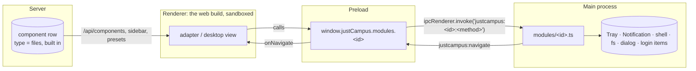

# Desktop modules

Desktop modules are features that only the desktop app offers, because they
need the operating system: a tray icon and native notifications, the local
file system and network drives, autostart and `jlucampus://` links. The web
app and the PWA never show them.

This document is the concept. The branch that introduces it also contains a
working prototype of the three example modules.

## Decisions

| Question                              | Decision                                                                                                                                                                    |
| ------------------------------------- | --------------------------------------------------------------------------------------------------------------------------------------------------------------------------- |
| Where does the code live?             | **Only in the Electron app** (main process and preload) plus UI in the web build that stays dormant in a browser. No server endpoints.                                      |
| What does the web app show?           | **Nothing.** Without the desktop bridge there is no sidebar entry, no page, no settings section.                                                                            |
| How does a module with a page behave? | **Like any component.** The server keeps one built-in component row per such module, so users add, remove and sort it in "More apps" and admins put it into layout presets. |
| Example modules                       | Notifications and tray, files and network drives, autostart and links.                                                                                                      |

So there are two kinds of desktop modules:

- **With a page** (`files`): a _desktop component_ in the catalogue, type
  listed in `DESKTOP_COMPONENT_TYPES`. The row is only a reference: it has no
  config, no secrets, no widgets and no endpoints. It exists so that
  `sidebar_entry` and layout presets can point at the page like at any other
  component.
- **Without a page** (`notifications`, `system`): settings in the "Desktop
  app" section of the settings dialog, plus background work. Nothing on the
  server.

## Anatomy of a module

Every module has up to four parts, tied together by one id from
`DESKTOP_MODULE_IDS` in shared:

```
packages/shared      DesktopModuleBridges[id]          the contract: methods and data types
apps/desktop/main    modules/<id>.ts                   does the work with Electron and Node APIs
apps/desktop/preload builds window.justCampus.modules[id] from IPC calls
apps/web             src/adapters/<id>/ (page)         the page, as a component adapter with `desktopModule: id`
                     src/desktop/<id>/ (no page)       Settings and Service, drawn only when the bridge has the module
apps/server          modules/registry.ts               only for modules with a page: name and icon of the built-in row
```



- **Contract (shared).** `DesktopModuleBridges` maps each id to its bridge
  interface. `DesktopBridge.modules` is `Partial<DesktopModuleBridges>`: a
  missing key means the running app does not have the module.
  `DESKTOP_COMPONENT_TYPES` lists the modules with a page; their component
  type has the module's id as its name.
- **Main.** `apps/desktop/src/main/modules/index.ts` is a registry typed
  `{ [Id in DesktopModuleId]: DesktopMainModule<Id> }`, so an id without a
  main module fails type checking. A module's `setup(context)` registers its
  IPC methods through `context.handle`, which checks the sender and names the
  channel `justcampus:<id>:<method>`.
- **Preload.** Turns every method into an `ipcRenderer.invoke`. It is the
  only place that sees Electron objects such as a dropped `File`
  (`webUtils.getPathForFile`).
- **Web.** A module with a page is an ordinary component adapter that names
  its `desktopModule`; `isAvailableHere(component)` hides such components
  wherever users see components (sidebar, "More apps", `/c/<id>`) unless the
  bridge offers the module. Modules without a page register `Settings` and
  `Service` in `src/desktop/registry.ts`.
- **Server.** Creates the built-in row of each desktop component at startup,
  **enabled** (unlike modules, there is nothing to configure first), and
  treats it like a module row: no second one, no delete, no type change.

The desktop app bundles its own copy of the web build, so the renderer and the
main process always come from the same commit. The bridge check is there to
tell the browser from the desktop app, not to negotiate versions.

## Where modules appear

| Place                               | What                                                                                    |
| ----------------------------------- | --------------------------------------------------------------------------------------- |
| Sidebar and "More apps"             | Desktop components, like every component: add, remove, sort. Hidden in the browser.     |
| Admin → Components                  | The built-in row with the badge "Desktop": rename, change the icon, disable. No delete. |
| Admin → Layout presets              | Desktop components can be part of a preset; browser users simply do not see them.       |
| Route `/c/<id>`                     | The page. In the browser the route answers "not found".                                 |
| Settings → "Desktop app"            | `Settings` of the modules without a page. The section is absent in the browser.         |
| Component pages                     | "Copy desktop link" in the header (system module).                                      |
| Tray, notifications, OS integration | Owned by the main process; the renderer only asks for them.                             |

**Sidebar edits in the browser keep hidden entries.** The sidebar is saved as
one list. When a user rearranges it in the browser, the ids of components the
browser hides stay in the list, so the desktop entry survives.

Desktop components add no dashboard widgets (see open questions).

## Local state

What a module stores lives on the device, in `desktop-settings.json` in
Electron's `userData` directory: the notification switches and the user's
own places (folders and network shares). The main process reads it
tolerantly (a broken or missing file means defaults) and writes it through a
temporary file and a rename. Nothing is synchronised: a second computer
starts with the defaults, and signing out does not clear it. Only the
sidebar entry of a desktop component is server data, like any sidebar entry.

## Security

The renderer runs third-party content next to the app (IFrame components) and
must not gain more than the modules intend:

- `sandbox`, `contextIsolation` and no Node in the renderer stay as they are.
  The preload runs only in the main frame, so embedded sites never see
  `window.justCampus`.
- **One IPC channel per method.** `context.handle` refuses calls that do not
  come from the main window's main frame on `app://-` (or the dev server in
  development). The main process checks every argument itself; types from
  shared are not validation.
- **Ids, not paths.** The files module gives the renderer ids for places and
  downloads and keeps the paths in the main process. The renderer cannot open
  an arbitrary path. The one exception is a dropped folder: the preload
  resolves the dropped `File` to its path, and main accepts only an existing
  directory.
- **No running of programs.** Downloads that are executables, installers or
  scripts (`.exe`, `.msi`, `.sh`, `.AppImage`, `.dmg`, …) are marked
  `openable: false`; the page offers only "show in folder" for them, and main
  refuses to open them anyway.
- **Paths from outside are checked.** `jlucampus://` links, notification
  clicks and tray entries only ever navigate to a path accepted by
  `isAppPath` (absolute, not protocol-relative, no dot segments).
- The CSP and the permission handler (deny everything) stay unchanged:
  notifications come from the main process and need no renderer permission.

## Example modules

### Files and network drives (`files`, desktop component)

A page like any component page:

- **Places:** Downloads, Documents and Desktop from the OS, plus folders and
  network shares the user adds, through the native folder picker, by dragging
  a folder onto the page, or as an address (`\\server\share` on Windows,
  `smb://server/share` elsewhere). "Open" shows the place in Explorer, Finder
  or the file manager.
- **Reachability of network shares:** a TCP check on port 445 with a 1.5 s
  timeout. "Not reachable" usually means the VPN is not connected.
- **Recent downloads:** the newest files in the Downloads folder with size and
  date, to open or to show in their folder.

The list of places is local, so admins cannot hand out JLU's network drives
yet (see open questions).

### Notifications and tray (`notifications`)

- Tray icon with a menu: open JLU Campus, dashboard, notifications on/off,
  quit. The tooltip shows the number of feeds with unread entries, as does
  the app badge where the OS has one (macOS, Unity launchers).
- **Close to tray** (on by default): closing the window hides it and the app
  keeps running; "Quit" in the tray menu ends it.
- **Native notifications for new feed entries.** A `Service` in the web app
  watches the RSS components in the user's sidebar through the same queries
  the sidebar dot uses (refetched every 10 minutes). An entry that appears
  after the first load and is newer than the user's last read produces one
  notification per feed; clicking it opens the feed's page. The first load
  never notifies, so starting the app does not replay old news.
- Settings: notifications on/off, close to tray, "send test notification".

### Autostart and links (`system`)

- **Autostart:** on Windows and macOS through the OS login items, on Linux
  through an XDG autostart file in `~/.config/autostart`. An autostarted app
  with "close to tray" on starts in the tray without a window. Development
  builds cannot switch it (the setting explains why).
- **`jlucampus://` links:** the installed app registers as handler of the
  scheme (`protocols` in `electron-builder.yml`, `setAsDefaultProtocolClient`
  at runtime) and holds a single-instance lock. `jlucampus://c/<id>` opens a
  component, `jlucampus://` the dashboard; a second start hands its link to
  the running app. Component pages get "Copy desktop link".

## Adding a desktop module

1. Shared: add the id to `DESKTOP_MODULE_IDS` and its bridge interface to
   `DesktopModuleBridges`.
2. Desktop main: implement `modules/<id>.ts` and add it to the registry; the
   type checker lists what is missing. Expose the methods in the preload.
3. Without a page: add `src/desktop/<id>/` with `Settings` and/or `Service`
   and register it.
4. With a page: also add the id to `COMPONENT_TYPES` and
   `DESKTOP_COMPONENT_TYPES` (config `desktopComponentConfigSchema`, no
   secrets, no widgets), its name and icon to `desktopComponentDefaults` on
   the server, and a component adapter with `desktopModule: '<id>'` in the web
   app. The server creates the row at its next start.
5. Texts under `desktop.<id>` (and `componentTypes.<id>`) in `de.json` and
   `en.json`.

## Open questions

- **Central configuration.** Admins can now switch a desktop component off
  and place it in presets, but not preconfigure it: JLU cannot hand out its
  network drives yet. A config on the built-in row (e.g. `networkDrives`) that
  the page merges with the user's own places would do it.
- **Dashboard widgets.** A desktop component could add widgets like any
  component ("recent downloads"). The dashboard is saved as a whole like the
  sidebar, so browser edits would have to keep tiles of hidden components in
  the same way; the web grid would show gaps where they sit.
- **Page-less modules centrally.** Notifications and autostart remain purely
  local; if IT wants defaults (e.g. autostart on), that would be a policy the
  server sends with `/api/me` or an OS-level policy read by the main process.
- **Background work while hidden.** Feed notifications rely on the renderer
  staying alive in the tray. Chromium throttles timers of hidden windows but
  still runs a 10-minute refetch; if that proves unreliable, polling moves to
  the main process.
- **Platform gaps.** GNOME shows tray icons only with the AppIndicator
  extension; Windows toasts need the installed app's `AppUserModelId` (set at
  startup, but they do not appear from a development build); the badge exists
  only on macOS and Unity launchers. Protocol registration for the AppImage
  needs desktop integration (e.g. AppImageLauncher); the `.deb` registers it.
